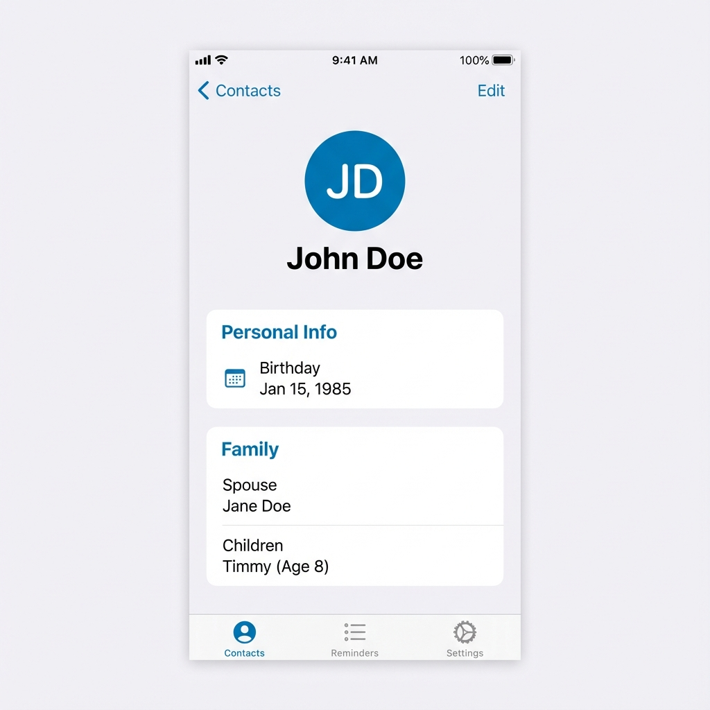
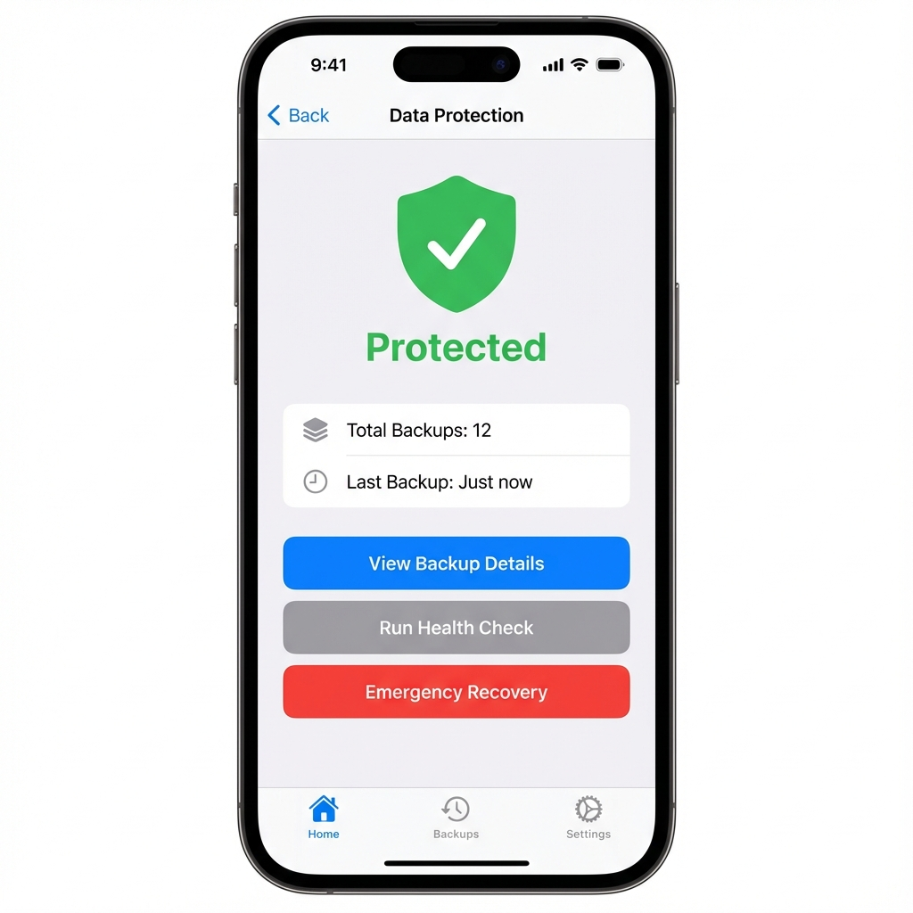

# Welcome to Forgetze
*"Never Forgetze a person's name ever again."*

Forgetze is your personal relationship manager, designed to help you keep track of the important people in your life—their birthdays, families, and milestones—without the clutter of traditional contact apps.

---

## 🏠 at a Glance

The **Home Screen** is your command center. It gives you a clean, sorted list of everyone you care about.

- **Search**: Tap the search bar or use the **Microphone** to find people instantly using your voice.
- **Add Contact**: Tap the big blue **+** button to add someone new.
- **Quick Details**: See names, birthdays, and key info right from the list.

---

## ✏️ Adding & Editing Contacts

Adding a contact is simple but powerful. You can track as little or as much as you want.

### Family Tracking
Forgetze understands that people come with families.
- **Spouse**: Add their partner's name and birthday.
- **Children**: Track kids' names and ages so you never ask "How old is Timmy now?" again.

---

## 📋 Comprehensive Details

Tap any contact to see their full profile.

The detail view is organized into clear cards:
1.  **Personal Info**: Birthday, Age, and Next Birthday countdown.
2.  **Family**: A dedicated section for their spouse and children.
3.  **Notes**: A place for those little things you want to remember (e.g., "Allergic to peanuts", "Loves sci-fi").
4.  **Social**: One-tap links to their social profiles.

---

## 🛡️ Data Protection

We take your data seriously. Forgetze includes an industrial-strength **Data Protection System**.

- **Automatic Backups**: Every time you save or delete a contact, we create a secure backup instantly.
- **Health Check**: Run a diagnostic scan to ensure your data is consistent and error-free.
- **Emergency Recovery**: Accidentally deleted everything? One tap restores your data to the last safe state.

### How it works
1.  Go to **Settings > Data Protection**.
2.  You'll see a green "Protected" shield if everything is good.
3.  Tap **View Backup Details** to see a log of every safe-save we've made for you.

---

## 📤 Export & Share

Need to move your data?
- **PDF Export**: Create a beautiful, printable page for any contact.
- **vCard**: Share contacts with other apps or phones.
- **Apple Contacts**: Sync directly to your phone's native address book.

---

*Forgetze v1.0 User Guide*
